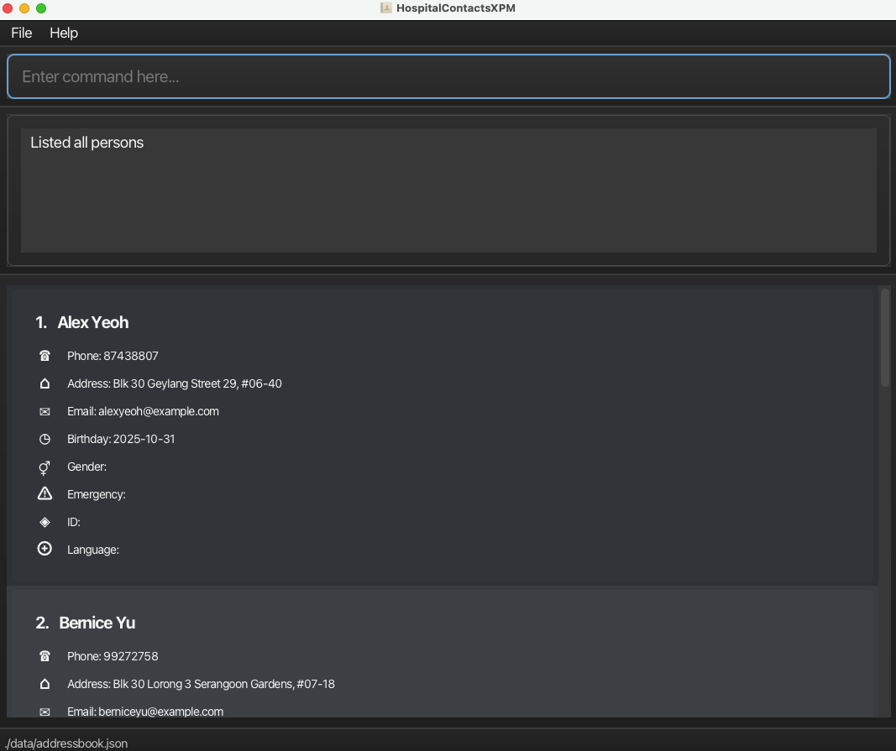
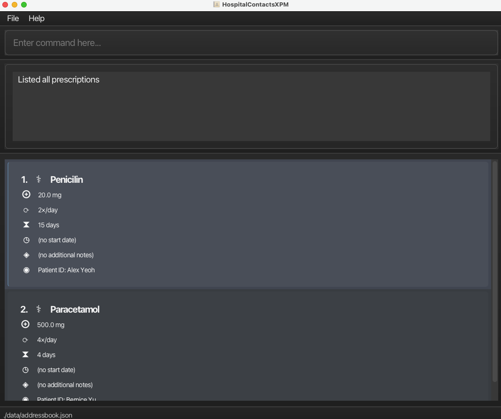
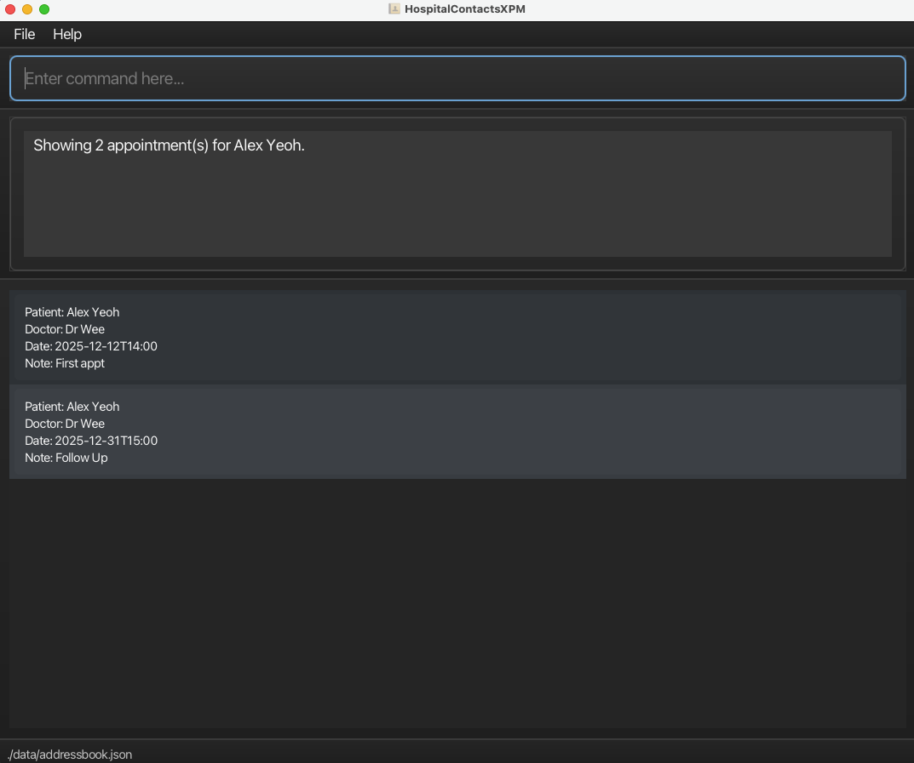

## Introduction

HospitalAdminProMax is a **desktop app built on AddressBook Level 3 (AB3) to help manage patient details in a high-volume patient environment**. We leverage the optimised nature of AB3 on the Command Line Interface (CLI) so if you can type fast, AB3 retrieves your patient details faster than traditional GUI apps. There still remains the benefits of a Graphical User Interface.

### What We Assume You Know
- Basic computer skills and familiarity with typing commands (preferably a fast typist)
- Understanding of common medical terms and patient data fields
- Experience with desktop applications and file management

### Key Benefits
- **Speed**: Retrieve patient information faster than clicking through GUI menus
- **Accuracy**: Structured data entry reduces errors in patient records
- **Organization**: Keep patient information, appointments, and prescriptions in one place

* Table of Contents
{:toc}

---

## Quick start

1. Ensure you have Java `17` or above installed in your Computer. 
   **Mac users:** Ensure you have the precise JDK version prescribed [here](https://se-education.org/guides/tutorials/javaInstallationMac.html).

2. Download the latest `.jar` file from [here](https://github.com/AY2526S1-CS2103T-T17-1/tp/releases).

3. Copy the file to the folder you want to use as the _home folder_ for your HospitalContactsXPM.

4. Open the command terminal, type `cd PATH_TO_FOLDER`(`PATH_TO_FOLDER` is the path to the folder containing the downloaded jar file) into the folder you put the jar file in, and use the `java -jar hospitalcontactsxpm.jar` command to run the application. 
   A GUI similar to the below should appear in a few seconds. Note how the app contains some sample data. 

_list patients_

_list prescriptions_

_view appointments_

5. Type the command in the command box and press Enter to execute it. e.g. typing **`help`** and pressing Enter will open the help window. 
   Some example commands you can try:

   - `list` : Lists all contacts.

   - `i-add n/John Doe p/98765432 e/johnd@example.com a/John street, block 123, #01-01` : Adds a contact named `John Doe` to the Address Book.

   - `i-delete n/John Doe` : Deletes the patient with name John Doe.

   - `clear` : Deletes all contacts.

   - `exit` : Exits the app.

**For First-Time Users:**
We recommend practicing with these sample commands in order:
* `i-view n/Alex Yeoh` - View a patient's details
* `a-view n/Alex Yeoh` - Check their appointments
* `p-view n/Alex Yeoh` - Review their medications
* `doctors` - See available doctors

This gives you a complete picture of how patient data is organized in the system.

6. Refer to the [Features](#features) below for details of each command.

---

## Features

**:information_source: Notes about the command format:** 

- Words in `UPPER_CASE` are the parameters to be supplied by the user. 
  e.g. in `i-add n/NAME`, `NAME` is a parameter which can be used as `add n/John Doe`.

- Items in square brackets are optional. 
  e.g `n/PATIENT_NAME [note/NOTE]` can be used as `n/John Doe note/follow-up` or as `n/John Doe`.

- Parameters can be in any order. 
  e.g. if the command specifies `n/PATIENT_NAME p/PHONE_NUMBER`, `p/PHONE_NUMBER n/PATIENT_NAME` is also acceptable.

- Extraneous parameters for commands that do not take in parameters (such as `help`, `list`, `exit` and `clear`) will be ignored. 
  e.g. if the command specifies `help 123`, it will be interpreted as `help`.

- If you are using a PDF version of this document, be careful when copying and pasting commands that span multiple lines as space characters surrounding line-breaks may be omitted when copied over to the application.

### Viewing help : `help`

Shows a message explaining how to access the help page.

Format: `help`

### Listing all patients : `list`

Shows a list of all patients in the address book.

Format: `list`

### View information of a patient: `i-view`

Format: `i-view n/PATIENT_NAME`

Views all information about a patient by the provided keyword.

Examples:

- `i-view n/Alex Yeoh` Views information for patient with the keyword "Alex Yeoh" in their name

### Adding information of a patient: `i-add`

Adds a patient to the address book.

Format: `i-add n/NAME dob/BIRTHDAY g/GENDER p/PHONE e/EMAIL a/ADDRESS em/EMERGENCY_CONTACT id/ID_NUMBER lang/LANGUAGE`

- Add personal information of a new patient.
- Compulsory fields: name, birthday, gender, phone, emergency contact, id, lang, address.
- The date for birthday must follow the format YYYY-MM-DD.
- Currently, the app does not allow duplication in names.

Examples:
* `i-add n/John Tan dob/1990-05-15 g/M p/98765432 e/johntan@example.com a/123 Main Street em/Jane Tan - 91234567
    id/S1234567A lang/English`
* `i-add n/Sarah Lim dob/1985-12-03 g/F p/91234567 e/sarahlim@email.com a/456 Orchard Road em/David Lim - 87654321
    id/T9876543B lang/Chinese`

### Deleting a patient : `i-delete`

Deletes the specified patient from the address book.

Format: `delete n/ PATIENT_NAME`

- Deletes the patient with the specified PATIENT_NAME.
- The PATIENT_NAME is case-sensitive.

Examples:

- `list` displays 'Alex Yeoh' in the display.
- 'i-delete n/Alex Yeoh' will delete Alex Yeoh from the list.

### Viewing appointments: `a-view`

Displays all appointments scheduled for a specific patient, optionally filtered by a date range.

Format: `a-view n/<patient_name> [from/<YYYY-MM-DD>] [to/<YYYY-MM-DD>]`

- Shows all appointments associated with the specified patient.
- Optional to include a from and/or to date to filter appointments within a specific date range.
- If no date range is provided, all appointments for the patient will be shown.
- The patient must already exist in the address book.

Examples:

- `a-view n/John Doe` Displays all appointments for John Doe.
- `a-view n/John Doe from/2025-01-01 to/2025-12-31`Displays all appointments for John Doe scheduled
- between 1 January 2025 and 31 December 2025

### Adding an appointment : `a-add`

Schedules a new appointment for a patient with a doctor.

Format: `a-add n/PATIENT_NAME d/DOCTOR_NAME t/YYYY-MM-DD HH:MM [note/NOTE]`

- Creates a new appointment record for the specified patient and doctor.
- The NOTE field is optional and can include remarks such as visit purpose or follow-up notes.
- The date and time must follow the format YYYY-MM-DD HH:MM.
- The patient must already exist in the address book before scheduling an appointment.

Examples:

- `a-add n/Alex Yeoh d/Dr Wee t/2025-11-11 14:00 note/Fp`
- `a-add n/Bernice Yu d/Dr Tan t/2025-12-01 09:30 note/Annual check-up`

### Delete patient appointments: `a-delete`

Delete an existing patient appointment from address book.

Format: `a-delete n/PATIENT_NAME t/YYYY-MM-DD HH`

- Delete an existing patient appointment by patient name and appointment time.
- Patient name must be full name. Appointment must follow the format of YYYY-MM-DD HH.

Examples:

- `a-delete n/John Doe t/2025-11-11 14`
- `a-delete n/Betsy Crowe t/2025-12-01 09`

### Listing all prescriptions: `p-list`

Format: `p-list`

- Lists all prescriptions for any patient

### Viewing all prescriptions for a given patient: `p-view`

Checks a patient's prescription information.

Format: `p-view n/PATIENT_NAME`

Views all prescriptions listed in a similar UI style to Patients in `list`

Examples:

- `p-view n/Alex Yeoh` Views all prescriptions for the patient named "Alex Yeoh"

### Adding a prescription: `p-add`

Prescribe medication for a patient.

Format: `p-add n/PATIENT_NAME m/MEDICATION_NAME d/DOSAGE f/FREQUENCY dur/DURATION`

- Creates a new medication record for the specified patient.
- The DOSAGE is in milligrams.
- The DURATION is in days.
- The FREQUENCY is in times/day
- The patient must already exist in the address book before scheduling an appointment.

Examples:

- `p-add n/Alex Yeoh m/Panadol d/500 f/2 dur/3`
- `p-add n/Bernice Yu m/Methamphetamine d/1000 f/3 dur/365`

### Delete a prescription: `p-delete`

Format: `p-delete INDEX`

- Deletes the prescription whose position is at the provided index from the list of prescriptions after a `p-view` or `p-list`
- Can only be used if a list of prescriptions is displayed

Examples:

- `p-delete 1`: Deletes the first prescription in the list

### View doctors: `doctors`

Format: `doctors`

View the list of doctors available

Examples:

- `doctors`

### Clearing all entries : `clear`

Clears all entries from the address book.

Format: `clear`

### Exiting the program : `exit`

Exits the program.

Format: `exit`

### Saving the data

AddressBook data are saved in the hard disk automatically after any command that changes the data. There is no need to save manually.

### Editing the data file

AddressBook data are saved automatically as a JSON file `[JAR file location]/data/hospitalcontactsxpm.json`. Advanced users are welcome to update data directly by editing that data file.

:exclamation: **Caution:**
 
 
If your changes to the data file makes its format invalid, AddressBook will discard all data and start with an empty data file at the next run. Hence, it is recommended to take a backup of the file before editing it. 
 
Furthermore, certain edits can cause the AddressBook to behave in unexpected ways (e.g., if a value entered is outside of the acceptable range). Therefore, edit the data file only if you are confident that you can update it correctly.

### Archiving data files `[coming in v2.0]`

_Details coming soon ..._

---

## Common Workflows

### New Patient Registration
1. `i-add n/NAME dob/BIRTHDAY g/GENDER p/PHONE e/EMAIL a/ADDRESS em/EMERGENCY id/ID_NUMBER lang/LANGUAGE`
2. `a-add n/PATIENT_NAME d/DOCTOR_NAME t/YYYY-MM-DD HH:MM [note/NOTE]`
3. `p-add n/PATIENT_NAME m/MEDICATION_NAME d/DOSAGE f/FREQUENCY dur/DURATION`

### Daily Patient Check-in
1. `i-view n/PATIENT_NAME` - Review patient information
2. `a-view n/PATIENT_NAME` - Check today's appointments
3. `p-view n/PATIENT_NAME` - Review current medications

### Medication Management
1. `p-view n/PATIENT_NAME` - Check existing prescriptions
2. `p-add n/PATIENT_NAME m/MEDICATION_NAME d/DOSAGE f/FREQUENCY dur/DURATION` - Add new prescription
3. `p-delete INDEX` - Remove outdated prescriptions (after viewing list)

--------------------------------------------------------------------------------------------------------------------

## FAQ

**Q**: How do I transfer my data to another Computer? 
**A**: Install the app in the other computer and overwrite the empty data file it creates with the file that contains the data of your previous AddressBook home folder.

---

## Known issues

1. **When using multiple screens**, if you move the application to a secondary screen, and later switch to using only the primary screen, the GUI will open off-screen. The remedy is to delete the `preferences.json` file created by the application before running the application again.
2. **If you minimize the Help Window** and then run the `help` command (or use the `Help` menu, or the keyboard shortcut `F1`) again, the original Help Window will remain minimized, and no new Help Window will appear. The remedy is to manually restore the minimized Help Window.

---

## Command summary

### General basic commands

| Action    | Format, Examples                          |
| --------- | ----------------------------------------- |
| **Clear** | `clear`                                   |
| **Find**  | `find KEYWORD [MORE_KEYWORDS]`   e.g., |
| **List**  | `list`                                    |
| **Help**  | `help`                                    |

---

### Patient information commands

| Action                         | Format, Examples                                                                                                                                                                                                                                                                 |
| ------------------------------ | -------------------------------------------------------------------------------------------------------------------------------------------------------------------------------------------------------------------------------------------------------------------------------- |
| **Add Patient Information**    | `i-add n/PATIENT_NAME dob/BIRTHDAY g/GENDER p/PHONE [e/EMAIL a/ADDRESS] em/EMERGENCY_CONTACT id/ID_NUMBER lang/LANGUAGE`   e.g., `i-add n/John Tan dob/1990-05-15 g/Male p/98765432 e/johntan@example.com a/123 Main Street em/Jane Tan - 91234567 id/S1234567A lang/English` |
| **View Patient Information**   | `i-view KEYWORD [MORE_KEYWORDS]`   e.g., `i-view n/Alex Yeoh`                                                                                                                                                                                                                 |
| **Delete Patient Information** | `i-delete n/PATIENT_NAME`   e.g., `i-delete n/Alex Yeoh`                                                                                                                                                                                                                      |

---

### Appointment commands

| Action                 | Format, Examples                                                                                                                        |
| ---------------------- | --------------------------------------------------------------------------------------------------------------------------------------- |
| **Add Appointment**    | `a-add n/PATIENT_NAME d/DOCTOR_NAME t/YYYY-MM-DD HH:MM [note/NOTE]`   e.g., `a-add n/Bernice Yu d/Dr Wee t/2025-11-11 14:00 note/Fp` |
| **View Appointment**   | `a-view n/PATIENT_NAME [from/YYYY-MM-DD] [to/YYYY-MM-DD]`   e.g., `a-view n/Bernice Yu from/2025-01-01 to/2025-12-31`                |
| **Delete Appointment** | `a-delete n/PATIENT_NAME t/YYYY-MM-DD`   e.g., `a-delete n/Bernice Yu t/2025-12-25 09`                                               |

---

### Prescription commands

| Action                                | Format, Examples                                                                                                                                                      |
| ------------------------------------- | --------------------------------------------------------------------------------------------------------------------------------------------------------------------- |
| **Add Prescription**                  | `p-add n/PATIENT_NAME m/MEDICATION_NAME d/DOSAGE f/FREQUENCY dur/DURATION [s/STARTDATE]`   e.g., `p-add n/Charlotte Oliveiro m/Methamphetamine d/1000 f/3 dur/365` |
| **View Prescription (for a patient)** | `p-view n/PATIENT_NAME`   e.g., `p-view n/Alex Yeoh`                                                                                                               |
| **List all Prescriptions**            | `p-list`                                                                                                                                                              |
| **Delete Prescription**               | `p-delete INDEX`   e.g., `p-delete 3`                                                                                                                              |
